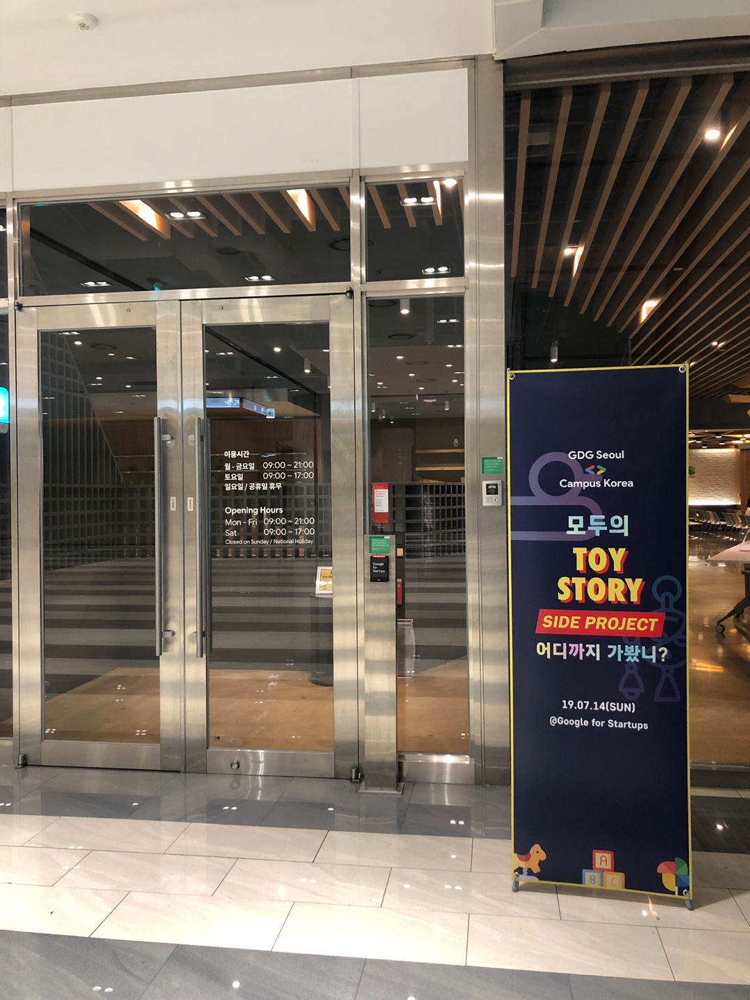
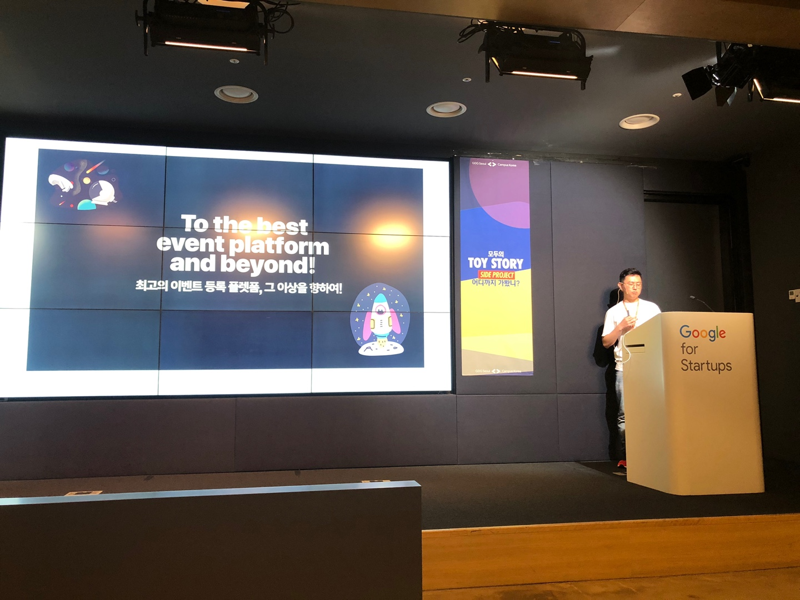
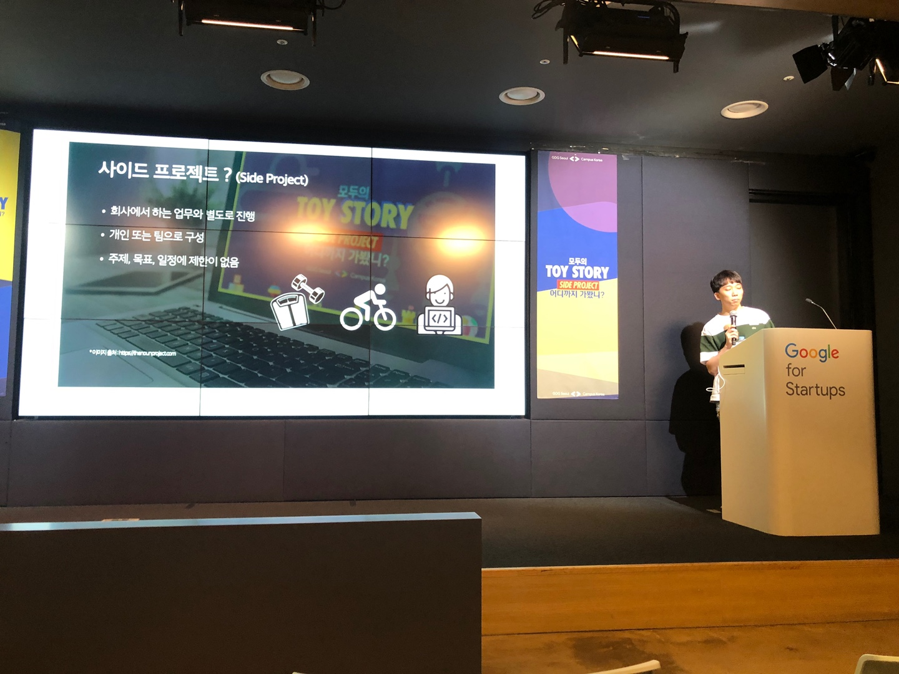
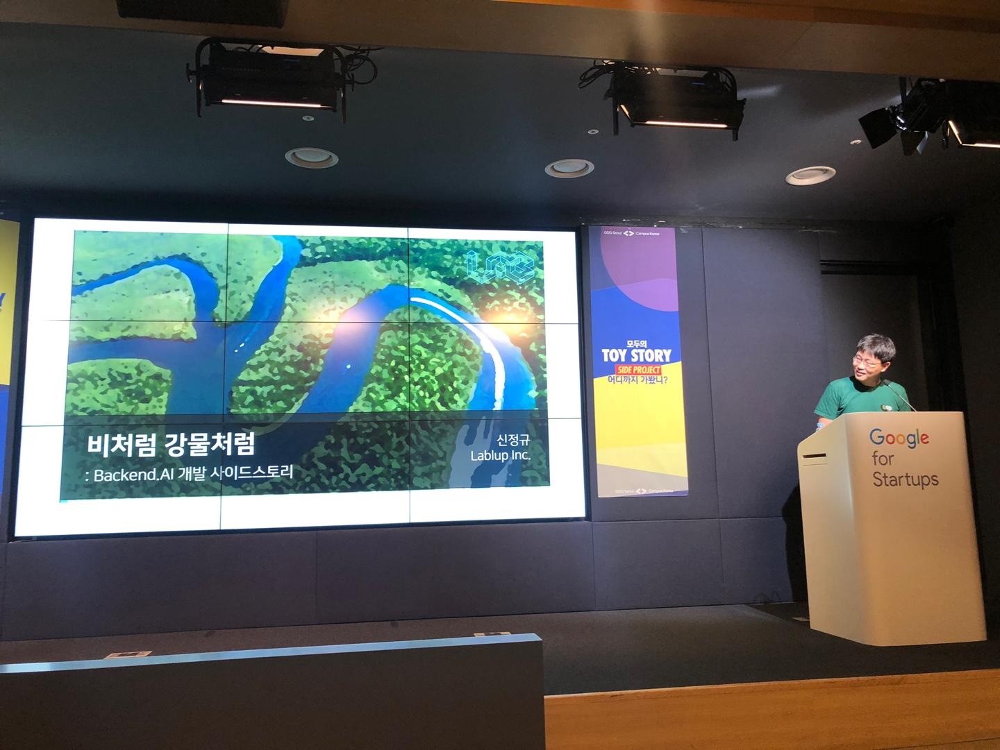

## 컨퍼런스 참가

GDG Campus Korea에서 개최하는 ```모두의 TOY STORY: Side Project 어디까지 가봤니?``` 컨퍼런스에 가게 되었다.🥰
부산 살땐 이런 행사 있어도 정말 그림의 떡이였는데, 올라오니 이건 정말 좋은듯.
첫번째로 경험했던 개발자 컨퍼런스가 작년 프론트엔드 컨퍼런스 였어서... 그땐 진짜 사람 너무 많고 정신 없고, 
그래서 일찍 갔더니 이번엔 또 너무 빨리 도착해서;; 
엄청 기다리다가 12시 땡 하자마자 입장했다.

들어갈때 프론트엔드:엔드게임 때 사용했던 스티커를 나눠준다🥰 
사실 저번에 엔드게임 컨퍼런스는 못가서 많이 아쉬웠는데 여기서라도 받아서 스티커 덕후는 기쁘다😂


## 발표 내용 요약  
혹시나 참가하고 싶었는데 참가 하지못한 사람을 위해 발표 내용 전반을 간단하게 요약해서 정리하였다.
전체 내용에 대해 상세하게 적을 순 없었지만 대략적으로 이러한 내용의 발표였다~는 정도만 참고하면 좋을 것 같다.

발표내용은 전체적으로는 나는 이러저러한 계기로 이러저러한 내용의 사이드 프로젝트 프로젝트를 진행 했었는데,
 해보니까 이러이러한 문제가 발생했고, 저러저러하게 해결했다, 하는 생생한 후기와 사이사이 틈틈히 유머와 꿅팁으로 구성되어 있었다. (+ 구인)

무슨 계기로 사이드 프로젝트를 진행하게 되었는가가 궁금했던 사람으로써 매우 긍정적인 참여가 되었던 것 같다. 

아래부터는 발표 내용 요약인데.. 너무 길어서 읽을 때 주의 해야 할 것 같다😅 
진짜 발표자분들이 다들 너무 유머러스하셔서 ㅋㅋㅋ 정말 컨퍼런스 내내 빵빵터졌는데 (거의 스텐딩코미디 보러 간 느낌)
그런 내용까지 다 요약할 수 없어서 너무 아쉽다ㅠ
  
주요 발표 내용만 담고 사족이나 구인구직 관련 내용들은 잘라냈다.
추가로 너무 길어서 1편과 2편으로 분리 시켰다 ㅜㅜ

## 1편 세션
1. 진겸님의 Festa!
2. 권태관님의 Daily-devBlog(기술블로그 구독서비스)
3. 권순선님의 KLDP
4. 신정규님의 BackEnd.AI

### 1. 진겸님의 Festa!

- 우리 서비스를 쓰는 자에게 최고의 경험을 → 목표
- 16년 웹 스터디하려다 무마된 멤버로 17년도 다시 모아서 사이드 프로젝트 해보자고 제안
- 처음 기획은 조직협업용 admin (Jira 같은거 만들어보자!) → festa의 청사진
- 그러다가 GDG 에서 행사 주최하려는데 마땅한 플랫폼이 없더라 → 그래서 시작됨
- 3번의 내용을 Pivot : Jira of Conferences → Ticketing Platform
- 느슨한 프로젝트에서 Deadline이 생김
- EDD : Event(개발용어가 아니고 진짜 이벤트) Driven Development
    ```text
    하나 이벤트 있으면 그거 시작전까지 개발하는...(ㅋㅋ)
    ```
- 결제 관련은 I'mport와 연동
- 디자인도 스케치로 빠짝 → 여기까진 즐겁고 행복
- 갑자기 여행 갔다 왔더니 이슈가 늘어나 있음(체감) TDD나 코드 리뷰를 할 수도 없고
- 일주일동안 고생하다가 서비스 오픈
- 한달동안 구르면서 느낀점: 더이상 못하겠다 (ㅋㅋㅋ) 배운점은 많았다
- 기술적 인사이트
    ```text
    회사는 정해진 대로 → 남들이 많이 쓴느게 왜 쓰이는지 알고, 스스로의 부족함을 많이 느끼게 됨
    협업의 어려움 : 분명히 다 뛰어난 사람들인데 협업이 너무 힘듦
    지킬 수 밖에 없는 데드라인= 발전 : 좀 느슨한 성격이라 스스로 데드라인 그어두면 좋음
    ```
- 2부 : 새로운 본격적인 시작
    ```text
    다시 새로 만들기로 결정
    기술 스텍도 변경
    코드 리뷰도 하기 시작했지만- EDD는 못바꿈(ㅋㅋ)
    ```
- 사이드 프로젝트라도 계획을 세워서 데드 라인을 그어야 발전이 있다.
    ```text
    처음부터 너무 크게 잡으면 이도저도 못하게됨
    Slack + Jira + Github + ??(적느라 못봄)
    ```
- 본격적으로 시작하니 현실문제도 부딫침
    ```text
    사업자 문제
    보증보험
    정산 위한 기초 자본금
    Business Model?
    ```
- PM의 어려움 → 각종 슬럼프 + 빠른 번아웃
- 프로젝트를 접어야 할 위기가 올땐 스스로 멘탈관리가 필요함
- 사이드 프로젝트의 한계
    ```text
    규모가 자꾸 커지면 엄청난 인력/시간 부족
    내 아이디어에 영감을 가져서 시작하는 사람들 → production까지 못가는 걸 수두룩 하게 봄
    가볍게 시작한 프로젝트는 가볍게 끝난다
    원동력을 찾아야 지속성으로 이어진다
    개발과 서비스는 다른 차원이다.
    ```
- 이런 문제가 생길 때 대처 방법(자꾸 이슈가 생기고 문제가 생길  때)
    ```text
    프로젝트 축소
    혹은 시간을 무진장 더 쏟는다(이때부터 사이드가 사이드가 아니게 됨)
    ```
- 3부 : The Next Step
- 우리 서비스를 쓰는 자에게 최고의 경험을 주는 것이 목표(최고의 사용자경험)
- 현재 수익이 거의 없어서 BM 꾸준히 찾는 중

### 2. 권태관님의 Daily-devBlog

- 오늘(0714)이 정식 서비스 1년 째!
- 사이드 프로젝트란?
    ```text
    회사에서 하는 업무와 별도로 진행
    개인 또는 팀으로 구성
    ```
- 왜 하나?
    ```text
    내가 필요해서
    번뜩이는 아이디어가 있어서
    새로운 지식을 습득하기 위해서
    ```
- 왜 만들었나?
    ```text
    SNS 챙겨보기 힘들어서 + 보다가 자꾸 딴짓해서
    다른 것에 집중하다보면 중요한 정보나 좋은 글을 놓쳐서
    다른 사람들의 글을 보며 자극 받고 싶어서
    내 블로그 홍보하고 싶어서 (ㅋㅋㅋ)
    RSS 리더 서비스를 직접 만들어 보자!
    ```  
- 기술 블로그 구독 서비스 소개
   ```text
    구독자: 이메일 신청
    인증 절차
    DB에 이메일 저장
    매일 정해진 시간에 메일 발송
    ```
- awesome-devblog : 저기 데이터를 보내줌
- 자바, 스프링 개발자 → 파이썬 + 플라스크
    ```text
    다들 파이썬 하길래 써봄
    한국인이 일본어 중국어 배우듯이
    ```
- 서버는 해로쿠 → 파이썬 에니웨어 → 라즈베리파이 → 결국 AWS (ㅋㅋ)
    ```text
    일반 물리서버보다 devops 지원이 잘되서
    ```
- 겪었던 문제
    ```text
    - 구독자 증가로 메일 발송이 너무 느려짐...
    - 기존엔 크롤링과 메일발송이 같은 서버에서 이루어져서 마지막 메일 받는 사람은 10시에 받는 사태
        - 크롤링은 미리 하고 메일은 시간에 보내도록 하는 것으로 변경
    - 1000명이 느려지니 또 느려짐
        - 주어진 환경에서 최대의 성능을 만들어보자(메모리가 적음)
            - threading을 통하여 해결
    - 메일 본문에는 css, js가 적용이 안된다?
        - emogrifier(inline-style 바꿔주는 서비스) 이용
    - 열심히 보냈더니 스팸처리됨
        - 구글 SMTP: 하루 500개 발송 제한
        - SMTP 서버를 구성해서 보냈더니 스팸처리됨
        - 가장 깔끔하고 발송관련 모니터링이 가능했던 SES(simple email service) tkdyd
    ```
- 모니터링도 하는 중
- 운영 중에 문의사항이 올라옴
    ```text
    필터링, 카테고라이징, 태그
    팟캐스트에서 나온 '양질의 글'을 찾는 서비스
    ```
- 가지고 있던 데이터에서 새로운 인사이트를 알게 된 경험
- 아카이브 기능도 추가
    ```text
    접근성을 용이하게 만들도록 크롬 확장프로그램도 만듬(경험 +1)
    ```
- 앞으로의 방향성은
    ```text
    이제 사비로 서버를 운영해야함..
    ```
- 하면서 무엇을 느꼈는가
    ```text
    - 강제 학습
        - 회사와는 별도 진행, 서비스에 대한 책임감
            - 오전 10시 되면 이젠 몸이 먼저 반응함(메일 잘 갔나?)
        - 경험으로 부터 나온 인사이트를 팀에서도 적용
    ```
- 지금부터 당장 무언가를 만들어 봐라
- 크기는 중요하지 않다!

### 권순선님의 KLDP

- KLDP 소개 : 
    ```text
    /. + sf.net or SO + Github + Wikipedia
  
    /. : 슬래시닷 옛날에.. (ㅋㅋ) 기술 관련 사이트...
    sf.net:  소스포지 → 깃헙의 전신
    SO: 스택오버플로우
    ```
- 계기
    ```text
    리눅스에 관심 가진 계기 ? 대학생활때 사귀던 여친과 깨짐 → 군대갈까 하다가 정신을 다른 곳에 집중하기 위한 수단
    ```
- 역사 : 20년에 걸친 KLDP의 발전과정
- 경력 + 있었던 일 : 전반적 인생 이야기를 해주심 (유명한 개발자들 직접 보고 오신거 짱부럽)
- 회고
    ```text
    - 행운: 리눅스 vs 델파이 중 고민 하다 리눅스 선택(탁월한 선택)
        - 열심히 해야 행운도 따라온다
            - 4 * 365 * 8 - 4 * 30 * 2 = 11440 → 사이드 프로젝트에 쏟은 시간
                - 1달은 신입사원 연수기간, 1달은 논산훈련소(병특)
            - 1만 시간의 법칙은 유효하다고 믿음
    ```
- 기술 :이것 저것 하다보면 문제가 생김 → 문제 해결하다 보면 삽질을 함 → 삽잘히다 보면 깊이파고 들어감 → 파다 보면 스스로 해결이 안되는 문제가 생김
- 인연 & credits : 여러 좋은 사람들에게 많은 도움 받아서 운영
- QA: 워라벨 → 그런거 없다(ㅋㅋㅋ), 내가 재밌는 일할 땐 워라벨 챙길 이유없다

### 신정규님의 BackEnd.AI

- 왜 딥러닝 모델 구현이 어려운가
   ```text
    - 오픈소스 + 클라우드 컴퓨팅 = 다 된건가?
    - 소프트웨어 관리의 복잡성
    - GPU 컴퓨테이션이 강력하고 쉽도록 만들어 보자
    ```
- "언제가 플랜 B를 만들어라. 언젠간 그개 플랜 A 보다 낫다는걸 발견할 때가 있을 겁니다"
- 가족 회의 중 계기가 생김 → 과정이 있는데 목표는? 연구와 창업을 위한 오피스 + 함께 살기 위한 집
- TextCube(현 티스토리) 프로젝트 (06~) 시작 → 13년후 이니시계로 돌아옴
- 만들 것 : 거대 샌드박스 기반의 프로그램 코드 + 데이터 실행 서비스
-  코드온웹 (15년도) 공개
- 하지 말아야 할 것들
    ```text
    - 이동형 하드웨어 → as가..
    - 딥러닝 모델 컨설팅, 챗봇 시스템 설계 컨설팅, 뇌 데이터 연구 과제 → 회사의 가치와 멀었다고 판단됨
    - CodeOnWeb 커스터마이즈 공금
    - 공통점: 할수 있는것 + 수익이 나는것
    - 문제점 : 그게 창업의 목표가 아니였다...
    ```
- 없음의 미학
    ```text
    - CI 도구: 창업 시작할때 자체 개발
    - 시드 머니가 바닥나갈때
    - 회사에 돈이 떨어지면 알게 되는것들
        - 엄청난 유혹들이 있다.(좋은 인수조건..)
        - 동료들의 확신의 정도와
        - 딸각발이 정신 (+ 자린고비 정신도...)
    ```
- 진작해야했던것들
    ```text
    - GUI 개발
        - 아는 만큼만 보인다
            - GUI 필요성을 못느낌 (ㅋㅋㅋ)
        - 올해 GUI 개발시작
    - 해외 컨퍼런스 홍보 및 발표
        - 기술적으로 우리가 최전선에 있더라 (이미 이정도는 미국은 다되어있더라)
        - 가치 판단이 국내와 국외가 완전히 다르더라
            - 쿠버네티스 여부가 국내/국외 반응이 다름 
            - 국내: 쿠버 쓰면 되지 외않써?, 국외: 와 그걸 안썼어? 지니어스
    - 대규모 클러스터 설치도구 개발 
        - 메뉴얼 있으니까 다들 잘 하겠지 했음
        - 현실 : 보통 개발자에겐 설치하기 어려웠다
    ```
- 끝마치며
    ```text
    - 현재 행동은 의외로 미래의 나에게 영향을 미친다
        - 무엇을할지 모른다
        - 계획대로 가는 삶은 없는 것 같다
    - 만드는 시간 만큼, 사용하는 사람을 만나봅니다.
        - 개밥 먹는걸로는 같은 개들만 좋아하더라
        - 고양이도 만나고 돌고래도 만나야...
    - 시작한 후에 끝날 걱정을 미리 하지 맙시다
        - 기술을 멀리 예측하듯이 삶도 길게 관조하시면 눈앞에 집중할 수 있다.
        - 일단 질러라. 시작도 안했으면 끝 걱정도 못 했을 것이다
    ```
    

나머지 세션은 2편에서 이어집니다!