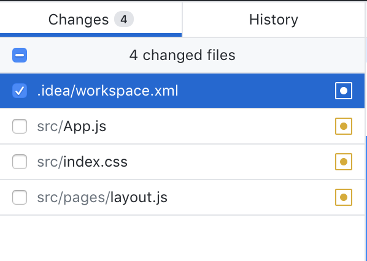

일 하면서, 공부하면서 알게된 소소한 팁을 기록하는 습관을 들이기 위해 이 글을 썼다.😄

부디 누군가에게 도움이 되길! 🙏

가끔 WebStorm 으로 새로운 프로젝트를 설정하고 git 셋팅까지 하고, ```.gitignore``` 파일까지 만들어 둔다음 
나중에 작업 실컷하다가 커밋하려고 보면


저렇게 수정한 적도 없는 .idea/workspace.xml 파일이 리스트 되면서 사라지지 않을 때가 있다.(~~우리집 묵은때처럼~~) 

심지어 .gitignore 에 추가해도 안 사라지는 경우가 있는데,

이는 이미 한번 이상 해당 파일을 repo에 **commit** 했기 때문이다.

따라서 이 문제를 해결 하기 위해선 **이미 올라간 파일들을 정리** 해주어야 .gitignore가 정상적으로 적용 된다.

우선 터미널을 켜서 git을 실행시킨다. 

다음으로 깃으로 올라간 .idea 디렉터리를 삭제한 후
```text 
git rm -r .idea  
```

다시 커밋해서 정리 해준다.

```text 
git commit -m "Remove .idea from repo" 
```

이제 보기싫은 .idea 파일도 안녕!
# 출처
https://stackoverflow.com/questions/19973506/cannot-ignore-idea-workspace-xml-keeps-popping-up