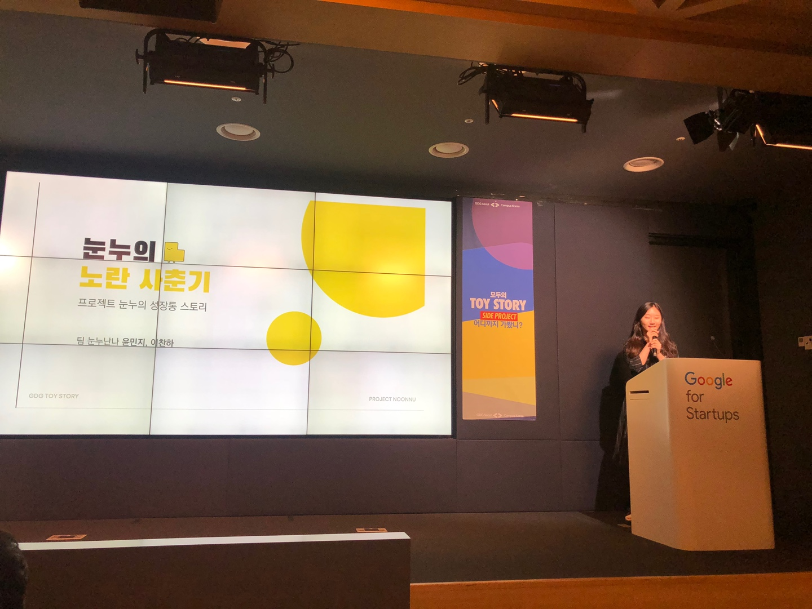
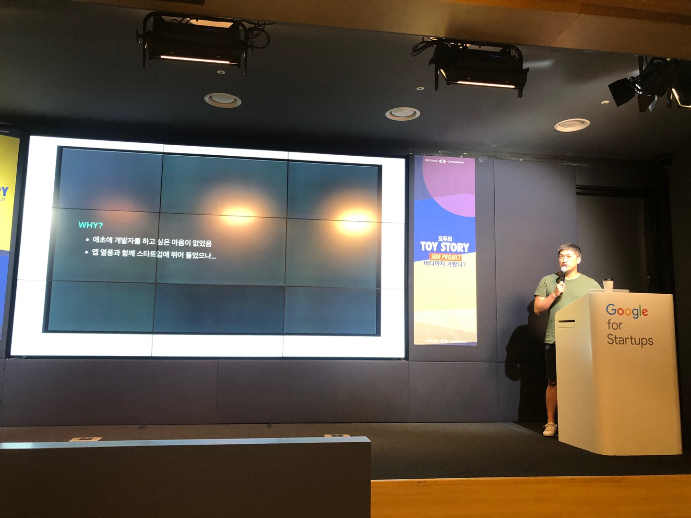

요약 2편입니다!

## 2편 세션
1. 팀 눈누난나의 눈누
2. 옥찬오님의 RosettaStone
3. 김승일님의 모두의 연구소
4. 김석준님의 QWER.GG + 짤봇

### 팀 눈누난나의 눈누

- 서비스를 만들고 성장하면서 겪었던 어려움에 대한 이야기 : PM과 개발자의 시점에서
- 눈누는
    ```text
    상업적으로 이용가능한 무료 한글폰트를 모아두는 서비스
    흩어진 폰트들을 한곳에 모여두고 사용해보고 하는 서비스
    ```
- 초보 PM 겸 디자이너 겸 개발자
- 프로젝트가 성장하며 생기는 문제들
    ```text
    - 오류 대응에 미숙
        - 갑작스러운 이용자 수 증가
        - 두명이서 서비스 운영 중이라 (학생신분) → 오류대응이 거의 못함 → 외부에 도움요청
        - 반복되는 오류, 반복되는 대응 미숙, 반나절 동안 사이트가 다운되어 있기도 함 → 이게 아닌데
        - 해결방안: 크루 모집 공고 : 능력있는 팀원을 모으자 → 해결! .. 인줄 알았으나
    - 프로젝트가 성장하며 생기는 문제 → 운영비의 발생
        - 서버비 발생
        - 시작 할때 멋쟁이사자처럼 AWS 1000 credit을 받음! → 이걸로 버티겠지 했는데 ...
        - 서비스 런칭 1년도 안되서 증발
        - 당시 필요한 돈 충당 방법
            - 비정기적으로 들어오는 소소한 후원금 → 불안정
            - 비정기적으로 하는 크라우드 펀딩 → 펀딩 실패시 샘플 제작비만 날리고 수익 0원 (오히려 마이너스)
        - 해결방안: 후원사를 유치 해보자! → 두곳의 후원사 유치성공 (컬쳐랩, 멋쟁이사자처럼)
        - 엄근진하게 지출관리 시작
            - 아낄 수 있는 건 아끼고
                - 과다하게 설정된 용량 줄여서 서버비 절감
                - 불분명한 지출처 확인해서 불필요하면 없애기
            - 쓰면 좋은덴 쓰고
                - 아낀 돈으로 EC2 하나 더 띄워서 Jenkins 사용
                - GDG TOY STORY에 눈누 홍보용 굿즈 제작
            - 비용 문제는 미리미리 생각해야한다.
    ```
- 정리하자면
    ```text
    - 팀이 서비스를 감당 못할땐 → 신중하고 빠르게 팀원 충원하자
    - 자금 문제는 미리미리 → 안일하다간 밑도 끝도 없는 마이너스
    ```
- 개발자 적인 시점 → 기술부채에 대한 이야기
- 기술부채: 기술적 문제를 뒤로 미루고 , 비즈니스 문제 해결 부터 한 것
- 땡겨쓰면 편하지만, 부채에는 이자가 붙습니다
- 빚을 지게 된 원인
    ```text
    - 개발자 숙련도 부족
        - 코드의 결과를 예상못함
    - 사이드 프로젝트의 한계
        - 문제에 대해 진지하게 오래 고민하지 못하고 본업으로..
    - 항상 급박한 상황
        - 우선 빨간 화면 안 보이게 고치고 생각하자!
    ```
- 빚을 진 결과
    ```text
    - 개발자의 의욕 저하
        - 해결되지 않은 오류의 늪에 빠짐
    - 서비스가 더 성장하지 못함
        - 기능이 추가되지 않으면 귀신같이 정체되는 MAU
    - 더이상 해결되지 않는 문제
        - 여기를 고치니까 이제는 저기가 터지기 시작
    ```
- 해결방법 : 눈누 2.0 개발 → 각자 잘하는 or 하고싶은 부분을 만들어보자
    ```text
    - 기술 스택 업그레이드
    - 일정 관리도 시작
    ```
- 느낀점 : 부채없이 살 순 없다..
    ```text
    - 많이 쓰고 있는 서비스를 갑자기 엎을 수도 없고
    - 돌발상황ㅇ은 빨리 해결하긴 해야하는 현실적 조건
    - 그러나 적절한 상환 계획이 필요함
    - 과도한 부채는 서비스 수명 단축 개발자 수명 단축
    ```

### 옥찬오님의 RosettaStone

- 사이드 프로젝트 소개
    ```text
    - RosettaStone
        - 전부 C++17
        - 오픈소스 프로젝트
    ```
- 새로운 팀원을 맞이하기
    ```text
    - 프로젝트 규모가 커지면 혼자서 감당하기 어려워짐
    - 그래서 팀원을 구하게된다.
    - 사이드 프로젝트라는게 ... 막상 해보면 너무 깊다
    - 열정으로 들어왔다가 막상 개발 해보려고 하니 구조를 이해하는데 어려움을 겪어 포기하는 경우를 많이 봄
    - 문서화의 중요성을 느낌
    - 팀원 오면 프로젝트 구조를 이해하고 기여할 수 있을 때까지 도와줘야 함
        - 그걸 위해서는 다음 사항을 준비해주면 좋다
            - 튜토리얼 문서
            - 예제 코드
            - api 문서화
            - 프로젝트에 기여하는 방법
    ```
- 팀원들끼리 프로젝트를 더 좋게 만드려는 목적은 같으나, 어떻게 좋게 만드려는 방법에 대하여는 다르다
    ```text
    - 생각의 방향이 달라서 코드 구조가 달라지는 경우가 발생
    - 팀원의 불화로 이어지고 프로젝트 위기 발생
    - 해결방법: 대화. 얘기를 많이 하자
    - 이후 룰을 정해서 대화를 많이 할 수 있는 방법을 만듦
    ```
- 프로젝트 관리 기준선
    ```text
    - 사이드 프로젝트가 관리가 잘 되고 있다는 기준은 어떻게 알까?
        - 프로젝트가 잘 빌드되는가?
        - 꾸준히 커밋되는가?
        - 프로젝트의 코드 스타일에 일관성이 이쓴ㄴ가?
        - 프로젝트 코드 품질은 잘 관리 되고 있느낙?
        - 프로젝트를 사용하기 위한 문서가 있는가?
    - 방침을 정해서 관리 했다.
        - 누구나 관심있으면 팀에 들어 올 수 있지만, 
        - 프로젝트의 관리 기준선을 아주 높게 만들자 (merge 기준선을 높임)
    ```
- 정리
    ```text
    - 사이드 프로젝트에서 지속성은 가장 중요한 요소
        - 3일 빠짝 하는 것보단 매일 2시간씩 꾸준히 오래오래 하는 게 좋음
    - 새로운 팀원이 궤도에 잘 오를 수 있도록 조력자가 되어주자
    - 팀원들과 논의할 공간/시간을 만들어야 함 같은 방향을 바라보도록 하는 것이 중요
    - 프로젝트 관리 기준선을 세우는 것이 중요(개인적으론 높을 수록 좋다)
    ```
### 김승일님의 모두의 연구소

- 모두의 연구소는? 하고싶은 연구 주제가 있다면 누구든지 연구실을 만들고, 참여하는 열린 연구소 프로젝트
- 어떻게 시작되었나
    ```text
    - 개발자 카페를 만들고 싶다는 아이디어에서 시작
    - 하고싶은 프로젝트를 함께 하는 곳을 만들자 → 과연 우리가 그걸 서포트 할 수 있을까?
        - 테스트 위해 직접 프로젝트 진행 → 드론 프로젝트 진행 (아이디어 검증)
        - 만들면서 블로그에도 쓰고, 강연도 하고, 책도 쓰고.. 쇼핑몰도 만듦
    - 서비스 만드려고 하니 주변에서 반대함
    - 어차피 망할거 빨리 해보고 빨리 망하고, 빨리 다른거 하라는 친구의 조언
    - 하고싶은 걸 하는 연구소인데 내가 하고싶은걸 안하면서 어떻게 사람들이 서비스를 이용하겠는가
    - 처음 서비스 시작할 땐 3개의 연구실, 15명의 연구원 
    - 첫번째 시련: 공간대여점에서 쫓겨남 → D.CAMP 으로 이전
    - 두번째 시련: 하고싶다 ≠ 할 줄 안다 → 상생하는 문화가 발생(각자 가진 텔런트를 나눠서 상생을 시작함)
    - 세번째 시련: 연구소니까 프로젝트 기반이여야 하는데 스터디모임이 됨 → 못하게 했지만 → 또 스터디함 → 이게 아니구나 → 풀잎스쿨 스터디 만듦
    - 사이드가 아니게 됨 연구소 3개에서 50개, 이용자 수도 400여명으로 커짐
    - 이제는 모두의 연구소가 메인 프로젝트가 되었다.
    ```
### 김석준님의 QWER.GG + 짤봇

- 왜, 어떻게 사이드 프로젝트로 서비스를 만들게 되었나
- 많은 사이드 프로젝트를 만듦 
- 원래 개발자가 될 일 없었음 → 앱 열풍이 불때 스타트업에 뛰어듦 → 외주 개발자와 소통 힘듦 → 에이 내가 만들고 말지
- 여기서 얻은 인사이트
    ```text
    - 하드웨어는 하지말자
        - 부품 구매/배송/관리 비용이 큼
        - 프로토타입과 제품의 거리가 멈
    - 앱은 하지말자
        - 개발은 하겠는데 배포가 지옥
        - 겨우 배포해도 다운로드를 안받음
    - 내가 좋아하고 필요한 걸 하자
        - 의미있는걸 찾다 보면 현타 심하게 옴 (내가 왜 이걸 하지..)
        - 돈 될거 같아서 해봐야 아무도 안 옴
    ```
- 짤봇
    ```text
    - giphy의 한국형
    - 짤 가져오는 기능, 추가하고픈 짤이 있을 때 추가, 도움말 기능
    - 어덯게 ㄷ만들ㅁ?
        - 짤 크롤링
            - api를 그대로 오픈해두는 곳이 많음
            - 확장성이 없다는 고민
        - UI
            - 슬랙 slash command가 잘되어 있음
            - 배포는 개발한지 2년만에.
            - 추가 UI : Web, IOS, 텔레그램
        - 기타
            - 설계고 뭐고 일단 되게 하자
            - 비용이 얼마나 나오겠어
    - 어려웠던 점
        - 배포 너무 귀찮음
        - 빌드 자동화 → 젠킨스 쓰기로 함
    - 사용자
        - 11번가, 아프리카TV, PUBG, 빅스비 등 150여개 에서 사용 중
    ```
- QWER.GG
- 사이드 프로젝트는 자신과의 약속
- LCK 개막이 다가오는데 best.gg가 일을 안함
- 리그 정보가 없어서 어디서 중계하는지도, 언제 하는지도 모르겠다
- 덕질을 못한다 이놈들아 → 내가 만들거임
- what
    ```text
    - 일정 볼 곳이 없으니까 저장해두자
    - 경기할때 되니까 알려줌
    - 트위치나 유툽 라이브도 
    ```
- How : 경기 일정과 결과를 어케 넣지 → 어드민을 만들자 → 귗낳다 → 크롤링을 만들자 → api를 찾아봤는데 없다 → 부들부들 → 뒤져서 소스 확보
- 홍보 시작 : 인벤 홍보, 해설자에게 피드백 받기
- what
    ```text
    - 내 니즈는 다 했는데 이제 뭐하지
    - 경기 데이터 보여주세요
        - 아이템, 빌드, 룬
    - 국제 리그에 나오는 팀들 뭐하는 사람임?
        - 전세계 리그를 다 긁어 오자
    - 매치/빌드 데이터 손으로 넣다가 다시 크롤링함
    - 공짜 트래픽을 위한 SSR, SEO (강조)
    - 운영/테스트 해 줄 사람이 없으니 데이터라도 쌓자 (sentry, ga) (강조)
    - log를 slack에 쌓으면 언젠가 보겠지
    ```
- 현재
    ```text
    - 데이터 분석을 통해 지표 생선 및 승률 예측 개발 중
    - 라이엇게임즈 api 받음 선수와 나의 성적을 비교하는 기능 추가할 예정
    - LCK 상위권 팀과 데이터 관련 파트너쉽 예정
    ```
- LESSON
    ```text
    - 성공적인 사이드프로젝트를 위한 것은?
    - 짤봇을 방치하다가 1년반만에 다시 잡았는데 → 큰 무리 없이 다시 시작 할 수 있었음 → CI/CD는 바로 하자(jenkins)
    - 디자인 :
        -  디자인 없으면 서비스 힘듦, 
        - 디자이너와 협업하자, 
        - 디자인이 필요없는 UI를 선택하던지(슬랙, 트위치 앱같은거)
    - 주제
        - 내가 좋아하고 내가 필요하면
        - 남들도 좋아하고 남들도 필요하다
        - 가급적이면 크롤링이 가능한 주제로(팁)
    - 팀
        - 친한 사람들을 꼬시되 큰기대는 ㄴㄴ
        - 내가 못하는 걸 채워주는 사람이 좋음
        - 느슨하게 오래가는 팀이 좋음(것 같음)
        - 서로에게 모티베이션을 줄 수 있는 방향을 찾고 있음
        - 재밌게 지내도록
    ```
- 기술
    ```text
    - 부트업 시간이 짧은 기술을 선택
    - 피쳐 개발이 쉬운 기술을 선택
        - 기능 하나 개발하는데 디펜던시가 많으면 안됨
        - RDBMS는 가급적 피하자
        - 원래 개발하고 설계는 나중에 하는거임
    - 단순한 구조를 최대한 유지
    - 데이터 쌓기>>>>> 개발시간 짧을 수록>>>> 성능
    - 새로운 기술은 적어도 파운더는 고르면 안됨
        - 아는것만 하고 모르는 건 최대한 뒤로 미루기
        - 배움이 끝나면 모티베이션이 급격하게 하락할 수 있음
    ```
- 워사밸 (워크/사이드프로젝트 밸런스) (ㅋㅋㅋ)
    ```text
    - 쉴땐 쉬자
    - 자동화가 핵심
    ```
    

저번에 엔드게임 컨퍼런스 참여 하려다 실패하고(피켓팅ㅠㅠ) 한동안 다른 좋은 컨퍼런스 없나 찾아보다 발견하게된 컨퍼런스인데, 
잘 운영되고 있는 사이드 프로젝트 개발자는 어떤 사람일까 궁금해서(ㅋㅋㅋ) 가벼운 마음으로 갔다 온 컨퍼런스이기도 했다. 

근데 다들 사이드프로젝트인데도 불구하고 가벼운 마음으로 진행하는 분이 없었던 것이 없었던 것이 가장 와닿았다.(+ 자기반성도...)

몇몇 발표자분들도 강조했지만 꾸준히 하는게 가장 중요하다고 했던것처럼 
나도 다음에 좋은 아이디어로 사이드 프로젝트를 진행하게 된다면 다시끔 이 요약글을 읽어보며 강조했던 점을 상기시키면서 작업하고싶다.