원문 [https://markodenic.com/use-console-log-like-a-pro/](https://markodenic.com/use-console-log-like-a-pro/)

---

자바스크립트 디버깅에 `console.log()`를 사용하는 것은 개발자 사이에서 가장 흔한 방법입니다. 다만, 그것 말고도 더 있습니다...

`console` 객체는 브라우저의 디버깅 콘솔에 접근을 제공합니다. 브라우저별로 세부적인 동작 방식은 다르지만, 일반적으로 제공되는 _사실상의_ 기능 세트가 있습니다.

## \* 가장 흔한 콘솔 메서드들:

`console.log()` - 로깅 정보의 일반적인 출력
`console.info()` - 정보 표시를 가지는 로깅(\*역주: 파이어폭스에서만 "i" 표시가 나타납니다.)
`console.debug()` - 로그 수준이 `debug` 인 메세지를 콘솔에 출력
`console.warn()` - 경고 메세지를 출력
`console.error()` - 에러 메세지를 출력

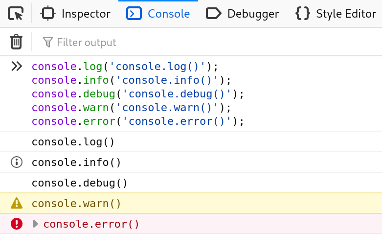

## \* 커스텀 CSS 스타일을 입힌 console.log()

`console.log()` 출력물은 CSS 서식 지정자를 사용해 DevTool에서 스타일을 줄 수 있습니다.

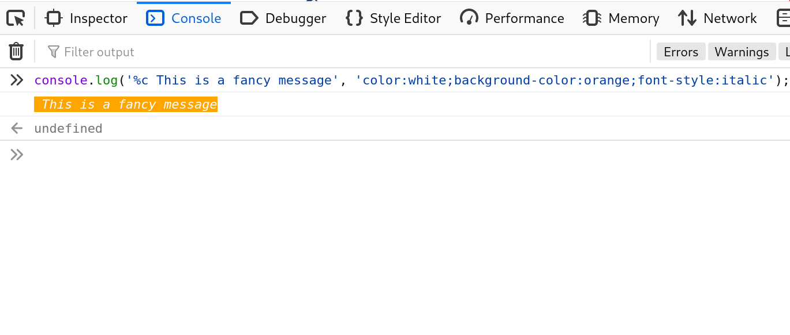

## \* 문자열 변수 대체

문자열을 허용하는 `console` 객체의 메서드 중 하나에(`log()` 같은) 문자열을 넘기고 싶을때는 다음 변수 대체 문자열을 사용할 수 있습니다:

`%s` - `stirng`

`%i` or `%d` - `integer`

`%o` or `%O` - `object`

`%f` - float

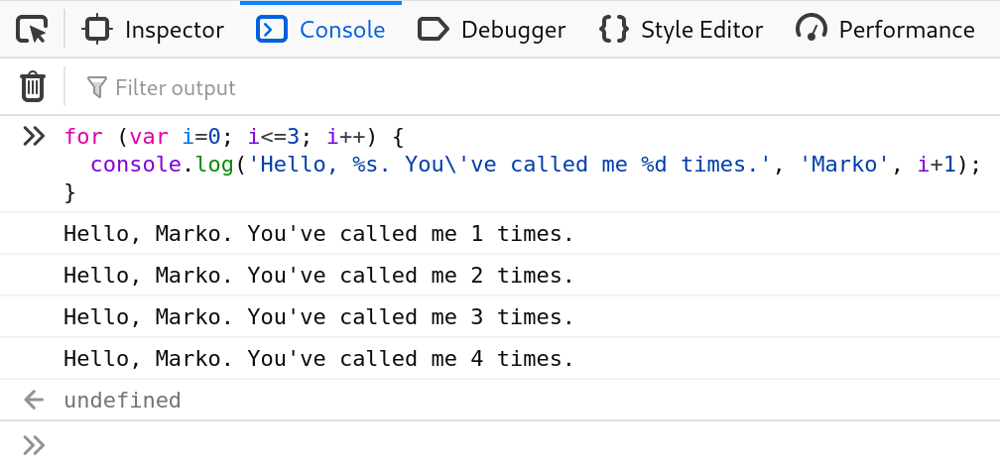

## \* console.assert()

첫 번째 매개변수가 `false`면 콘솔에 메세지와 스택 추적(stack trace)을 남깁니다.

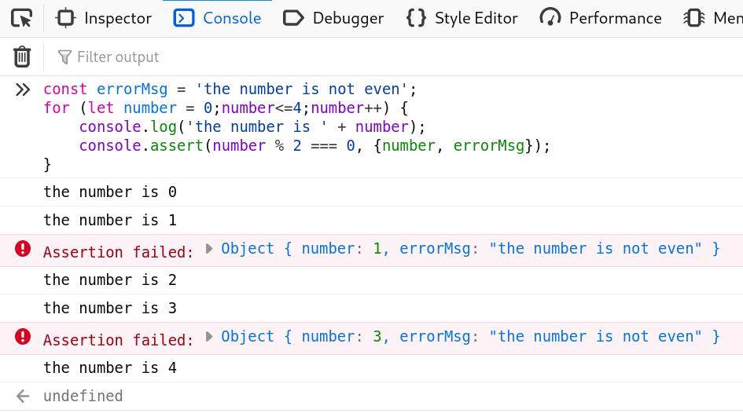

## \* console.clear()

콘솔을 클리어 합니다.

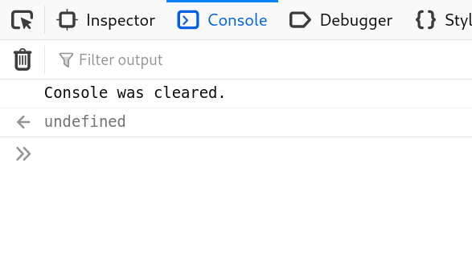

## \* console.count()

주어진 라벨과 함께 호출된 횟수만큼 로그를 기록합니다.

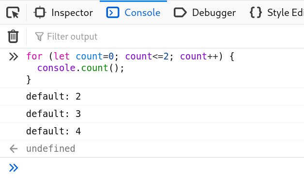

## \* console.dir()

지정된 자바스크립트 객체의 속성의 리스트를 보여줍니다.

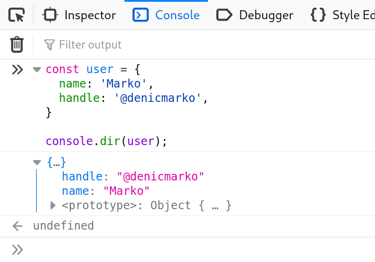

## \* console.group() 과 console.groupEnd()

모든 다음의 출력물을 다른 수준으로 들여쓰기해서 새로운 인라인 그룹을 만듭니다. 한 단계 뒤로 가려면 `groupEnd()`를 호출하세요.

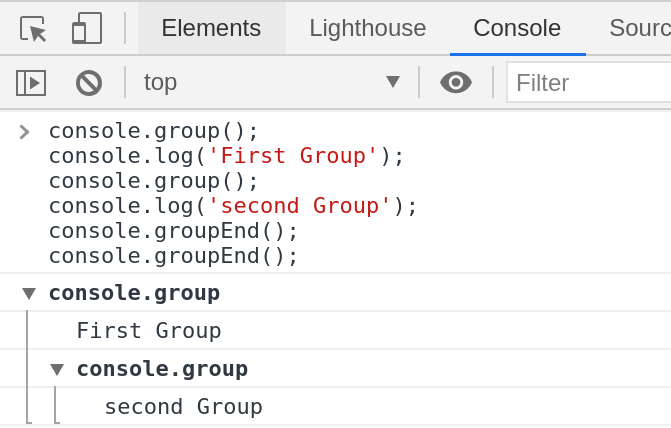

## \* 콘솔 안에 HTML 요소

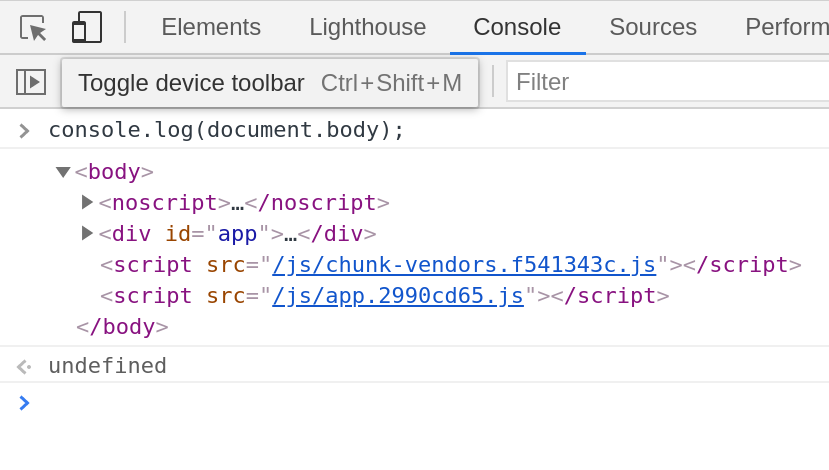

## \* console.memory

`memory` 속성은 힙 사이즈 상태를 확인하는데 사용할 수 있습니다.

Note: 메모리는 메서드가 아니라 속성입니다.

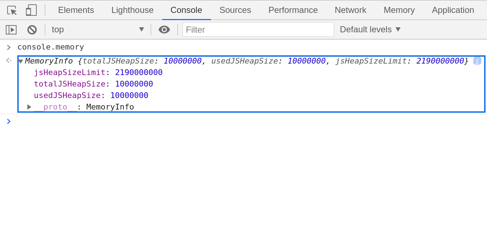

## \* console.table()

테이블 형식 데이터를 표로 표시합니다.

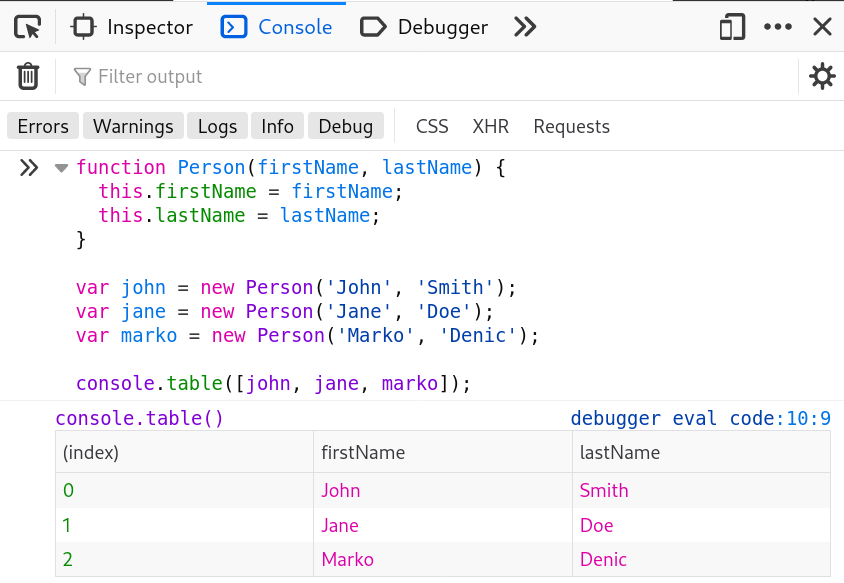

## \* console.time() 와 console.timeEnd()

`console.time()` - 입력 매개 변수로 받은 이름을 가진 타이머를 시작합니다. 주어진 페이지에서 최대 10,000개의 타이머를 동시에 실행할 수 있습니다.
`console.timeEnd()` - 지정한 타이머를 멈추고 시작한 시간부터 걸린 경과 시간을 로그로 남깁니다.

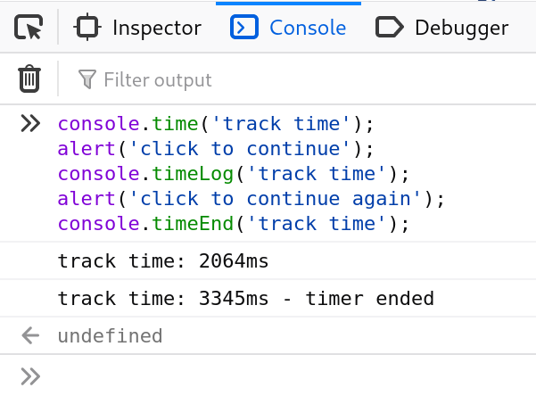

## \* console.trace()

스택 추적을 출력합니다.

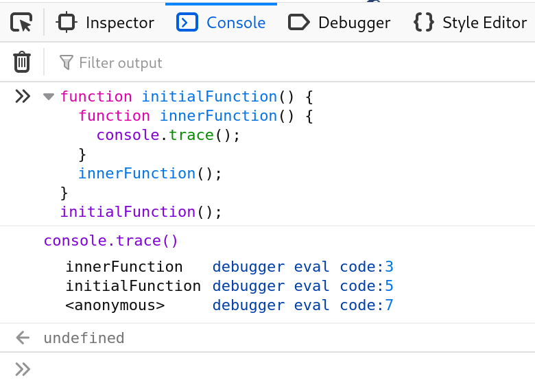
