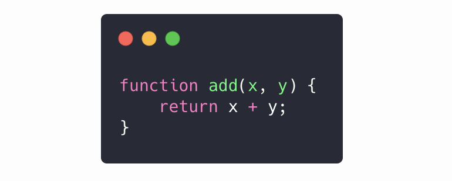
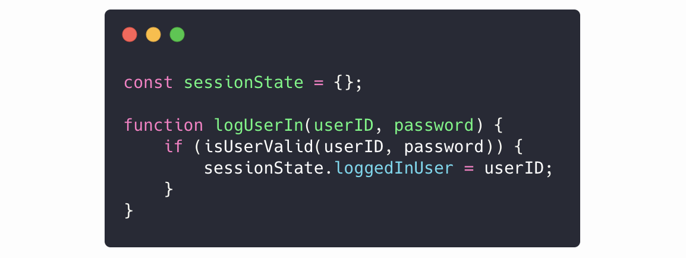
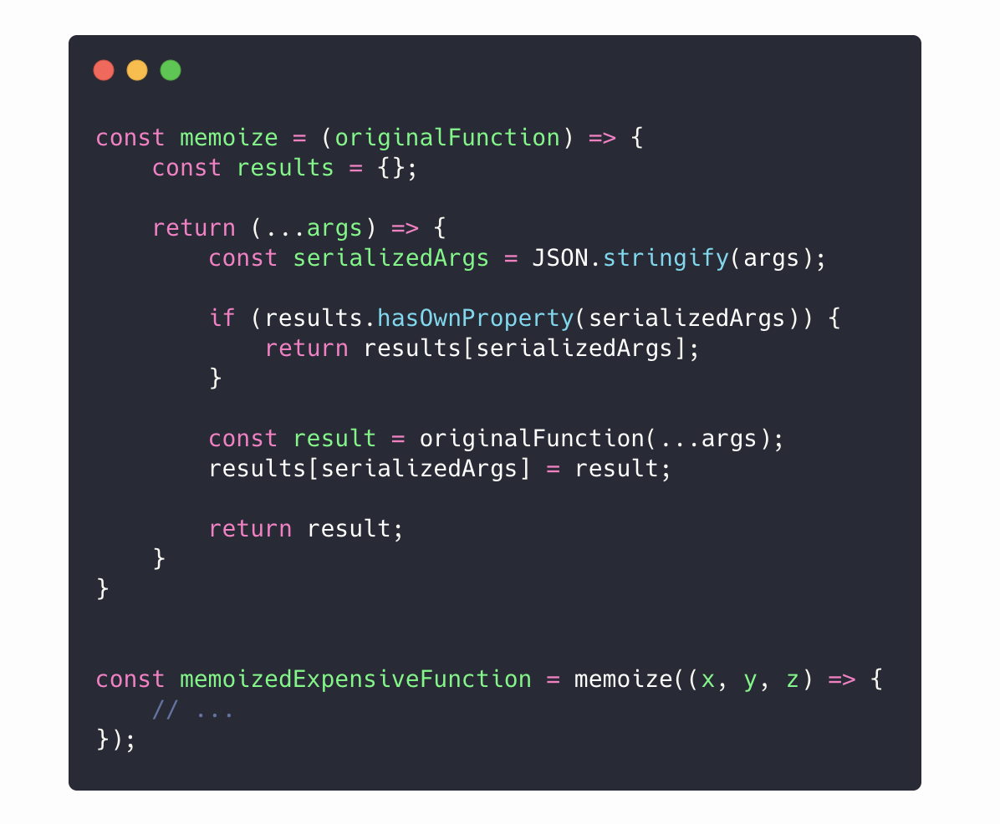
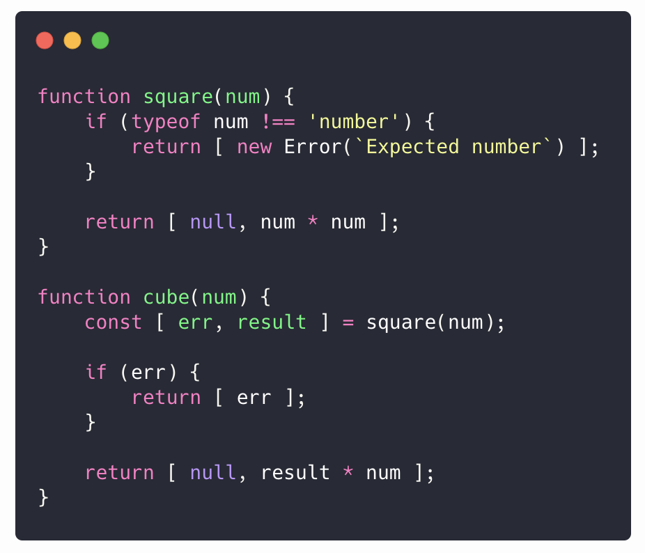
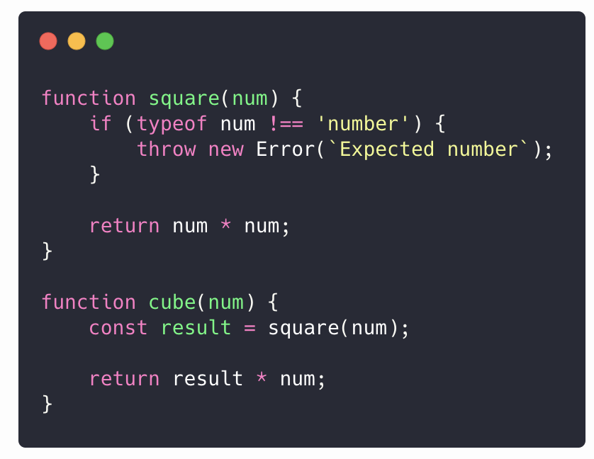

[원문](https://bluepnume.medium.com/functional-ish-javascript-205c05d0ed08)

번역하기 난해한 부분은 생략하거나 의역한 부분도 있을 수 있습니다 😅

---

함수형 프로그래밍은 자바스크립트를 작성할 때 배우고 적용할 수 있는 훌륭한 학문입니다. 무상태의(stateless), 멱등성의(idempotent), 부수효과가 없는(side-effect free) 코드를 작성하면 실제로 많은 문제가 해결됩니다:

- 테스트하기 쉬워짐
- 디버깅하기 쉬워짐
- 이슈를 재현하기 쉬워짐

하지만 커뮤니티에서는 함수형 프로그래밍은 모아니면 도라는 인식이 커지고 있습니다. 흔히 이런 말들을 듣습니다:

> 제 전체 코드베이스/앱은 스테이트풀(stateful)하고 부수효과로 가득해요. 근데 왜 굳이 함수형으로 만들어야 하나요?

> 저는 펑터(functors)나 모나드(monads), 커링(currying)이 뭔지(_역주: 함수형 프로그래밍의 기초 개념들입니다._) 배울 시간이 없어요. 언젠가 할거긴 한데, 그때가서 함수형 코드들을 짤 것 같아요.

> 저는 클래스 기반이나 객체 지향 코드가 좋아요. 그래서 함수형 코드는 저랑 안 맞는거 같아요.

하지만 함수형 프로그래밍은 모 아니면 도일 필요가 없습니다. 필자의 생각엔 좀 더 실용적이게 되는것이 좋을 것 같아요. 즉 말하자면, 다른 할일이 없으면 **함수형-스러운(functional-ish)** 코드를 작성해 보세요.

이게 무슨 의미 일까요? 필자는 요점을 설명하기 위한 일련의 법칙들을 생각해냈습니다.

# 순수하지 못하더라도 예측가능하도록

함수는 부수효과가 없을 경우 기능적으로 "순수"하다고 합니다. 순수 함수는 일련의 입력을 받고, 해당 입력을 기반으로 정확하고 확실하게 출력을 제공합니다. 다른 이펙트가 없고, 직접 입력한 입력외에는 다른 상태를 사용하지 않고, 입력값을 수정하지 않으며, 주어진 입력에 대해 출력은 항상 동일합니다.

가능한 순수함수를 작성하는 것이 좋습니다. 순수 함수는 테스트하기 쉽고, 문서화하기 쉽고, 리펙터링하기 쉽습니다.

그런데 만약 당신의 함수가 순수 할 수 없다면(실제로 시간이 많이 걸려서) 첫번째로 당신이 해야할 일은 예측가능하게 만드는 것입니다:

- 함수가 특정 부수효과를 트리거해야하는 경우, 동일한 입력이 주어질땐 해당 이펙트들이 항상 동일해야합니다. 서로 다른 입력이 서로 다른 부수효과를 트리거한다면, 그러한 이펙트들은 굉장히 예측 가능해야합니다.
- 함수가 다른 스코프(클로저 스코프나, 모듈 스코프 혹은 글로벌 스코프처럼)의 데이터나 상태를 소비해야 하는 경우, 앱의 미래 상태를 기반으로 시간이 지남에 따라 상태가 변경되거나 완전히 존재하지 않도록 복원해야 합니다.
- 함수는 전달된 파라메터가 객체나 배열같은 가변 데이터 구조일지라도 거의 변경하지 않아야 합니다. 이 규칙의 예외는 특정 목적을 가진 함수가 객체를 예측가능한 방식으로 변경하는 것일 겁니다; 부수효과가 명확한 `arrayRemove` 처럼요.

여기에 의구심이 든다면, 당신이 작성하는 함수에 [놀람 최소화 원칙(Principle of Least Astonishment)](https://ko.wikipedia.org/wiki/%EB%86%80%EB%9E%8C_%EC%B5%9C%EC%86%8C%ED%99%94_%EC%9B%90%EC%B9%99)를 따르세요.

# 상태 사용에 보수적이 되어라

순수함수는 외부 상태에 의존하지 않습니다. 이는 변수나 데이터가 함수의 내부나 외부에서 바뀌고, 이를 함수가 의존한다면 그 함수는 순수하지 않다는 뜻입니다.

현실에서, 코드에 어떤 종류든 상태를 사용하는 것은 피할 수 없습니다. 그렇긴해도 최소한 그 상태가 스테이트풀이 되어야 할지 신중히 고려할 수는 있습니다.

- 필요한 데이터가 다른 입력이나 가지고있는 기존 상태를 기반으로 파생되어야 하나요? 만일 그렇다면, 상태로 저장하지 않는 것이 제일 좋습니다.
- 데이터가 한번쓰이고 버려지는 데이터인가요? 만일 그렇다면, 그 데이터의 유용성보다 오래 지속될 상태나 스코프 안에 지속되게 하지 마세요.
- 나중에 필요한 데이터, 혹은 앱의 생명주기(lifecycle) 내에서 점진적인 변경이 일어날 것이라 예상되는 데이터인가요? 드디어 당신은 데이터를 상태 안에 저장할 수 있는 좋은 이유가 있습니다.

# 범위를 유리하게 사용하라

일단 당신이 실제로 상태가 _필요하다고_ 정했다고해도, 아직 모든 계산이 끝난게 아닙니다. 어떤 상태는 함수 호출 기간보다 더 오래 존재해야하지만, 그래도 여전히 그 상태가 얼마나 오래 존재해야 하는지는 신중히 고려해야합니다.

다양한 범위를 활용해서 상태를 필요한 만큼만 유지할 수 있도록 할 수 있습니다:

- 현재 로직에만 필요하다면, `const` 나 `let`을 사용해서 현재의 블록 스코프에 저장하세요.
- 함수가 호출되는 전체 기간 동안 필요하다면, 함수 내부의 맨 위쪽단에 `const` 나 `let` 변수로 선언해서 그 안에 저장하세요.
- 만약 더 오래 존재해야 한다면 - 비동기 함수 호출이 끝날때까지 - 클로저 스코프 안에 저장하세요.
- 리엑트를 사용한다면 상태를 실제로 필요한 컴포넌트에 최대한 가깝게 두고, 컴포넌트 체인에 너무 높게 끌어올리지(hoist) 마세요.
- 여러 함수 호출에 걸쳐 뭔가 추적해야 할 경우 부모 함수의 스코프 안에 유지하거나, 혹은 모듈 스코프에 저장할 수도 있습니다.
- 상태가 여러 페이지에 걸쳐 유지되야한다면 임시로 서버 스토어나(세션처럼) 로컬스토리지에 저장 합니다.
- 아주 장시간 동안 존재해아 한다면 데이터베이스나 파일시스템 안에 저장하세요.

상태가 꼭 필요한 만큼만 유지되도록 범위를 선택하도록 노력하세요.

# 캡슐화된 상태

꽤 자주 스테이트풀한 데이터는 캡슐화될 수 있습니다.

예를 들어, 돌리기 위해 고비용을 치뤄야하는 함수가 있다면 - cpu 사이클이 많이 걸리거나, 비동기적으로 데이터를 가져와서 반환하는데 상당한 시간을 쓴다던지 - 몇개의 선택지가 있습니다:

- 수동으로 상태 변수를 생성해서 결과를 저장하고, 변수가 채워지지 않은 경우에만 함수를 재호출 하기.
- 아니면, 재사용가능한 `memoize` 함수 안에 상태를 추상화할 수 있습니다:

`memoize`는 스테이트풀한 함수입니다. - 우리는 반환된 메모이제이션된 함수가 존재할 동안 `results` 배열을 클로저 스코프 안에 저장합니다. 하지만 이렇게 함으로서, 단일 공간에 상태를 캡슐화하고, 메모이제이션하려는 다른 함수들이 자체 상태를 유지할 필요가 없도록 하며, 매번 잠재적인 새로운 버그를 발생시키는 것에 대해 걱정할 필요가 없게합니다.

상태의 특징은: _모든 코드_ 는 궁극적으로 특정 레벨에서는 스테이트풀하다는 것입니다. 순수함수적인 코드라도 부수효과와 상태가 있습니다; 메모리는 여전히 수정 중이고, 명령이 cpu로 전송되고 있으며, 컴퓨터의 온도는 상승중입니다.

중요한 것은: 이런 부수효과들과 상태가 상태와 관련된 버그가 발생하지 않을 정도로 충분히 잘 캡슐화되어 있냐는 것입니다. 스테이트풀한 로직에서 과하지않고 적합한 수준의 추상화를 찾는 것이 중요합니다.

# 예외에 너무 많은 걱정을 하지마세요

엄격하게 따지면 예외는 일반적으로 "함수형스럽지 않다"고 간주됩니다. 예외를 던지는 것은 올바르게 다루지 않을 경우 프로그램을 부술 수도 있는 부수효과를 낳습니다.

하지만 실제로는, 저는 예외를 또다른 반환 값의 종류로 간주합니다. 다음 코드를 봐주세요:

이 두개의 함수는 모두 순수 함수입니다. 이 함수들은 전달된 입력에 기반한 값만 반환하고, 절대 어느 예외도 던지지 않습니다.

여기 예외를 사용한 동일한 코드가 있습니다:

이 코드는 정확하게 같은 목적을 달성합니다; 모든 에러 전파가 암시적이고, 자바스크립트 엔진에 의해서 다뤄진다는 것을 빼고요.

네, 현실에서 두번째 코드 스니펫은 예외가 처리되지 않으면 내 프로그램을 부숴버릴지도 모릅니다. 그렇지만 프로그램 시작점에 단일 try/catch문 하나만 추가해서 잡히지 않은 예외를 처리하게 하면 쉽게 해결됩니다.

첫번째 코드 스니펫은 좀 더 명시적입니다; 그러나 훨씬 더 장황하고, 프로그래머가 발생시키는 오류를 만들 여지가 많습니다. 각각의 호출 시점에서 오류를 처리할 것인지, 호출자에게 에러를 전파할 것인지 수동으로 결정해야합니다; 현실에서는 대부분의 경우 전파하고 싶습니다.

제 취향은: 예외를 함수 호출의 예상 결과로 간주하고, 이 예외가 자동으로 콜 스택으로 전파될 것이라는 사실을 설명하는 겁니다. 저한텐 이 정도면 충분히 함수형-스럽습니다.
