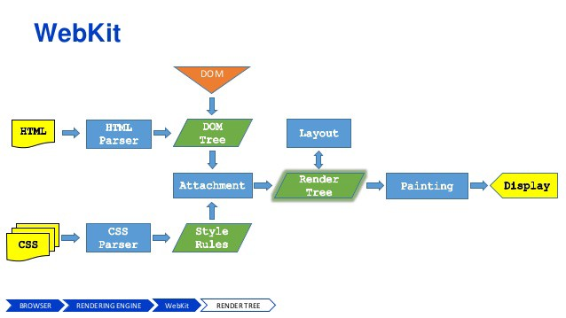

[원문](https://medium.com/swlh/what-the-heck-is-repaint-and-reflow-in-the-browser-b2d0fb980c08)

---

최근에 무엇이 React 가상 DOM을 빠르게 만드는지에 대해 리서치하는 중에 자바스크립트 성능에 대한 인식이 부족하다는 것을 깨달았습니다. 그래서 리페인트, 리플로우 그리고 자바스크립트 성능에 대한 전반적인 인지도를 높이기 위해 이 글을 씁니다.

# 본격적으로 알아보기전에, 브라우저가 어떻게 동작하는지 알고 있나요?

하나의 그림은 천개의 말만큼의 가치가 있죠. 그럼 브라우저가 어떻게 동작하는지 개괄적으로 살펴봅시다!

흠.. "브라우저 엔진(browser engine)"과 "렌더링 엔진(rendering engine)"이 뭘까요?

브라우저 엔진의 주요 업무는 HTML 문서와 다른 웹페이지의 리소스들을 사용자의 기기에 상호작용이 가능한 시각 표현으로 변환하는 것입니다.

"브라우저 엔진" 외에 해당 개념과 관련하여 "레이아웃 엔진"과 "렌더링 엔진" 두가지 용어도 일반적으로 사용됩니다. 이론적으로는 레이아웃과 렌더링(혹은 페인팅)은 별도의 엔진에 의해 처리할 수 있지만, 현실에서는 밀접하게 결합되어있어 별도로 고려되는 경우는 거의 없습니다.

# 브라우저가 어떻게 사용자 인터페이스를 스크린에 그리는지 이해해봅시다.

어떤 링크나 URL에서 엔터 키를 누르면 브라우저는 해당 페이지에 HTTP 요청을 보내고, 해당 서버는 (대게) HTML 문서를 응답으로 제공합니다.(이 사이엔 **정말 많은** [일들](https://cheapsslsecurity.com/blog/what-is-ssl-tls-handshake-understand-the-process-in-just-3-minutes/)이 일어나지요)

- 브라우저는 HTML 소스 코드의 구문을 분석하고, 모든 HTML 태그가 트리 내에서 해당하는 노드를 가지고 태그 간의 텍스트 조각(chunk)이 텍스트 노드 표현도 가져오는 데이터 표현인 **DOM 트리**를 구성합니다.
