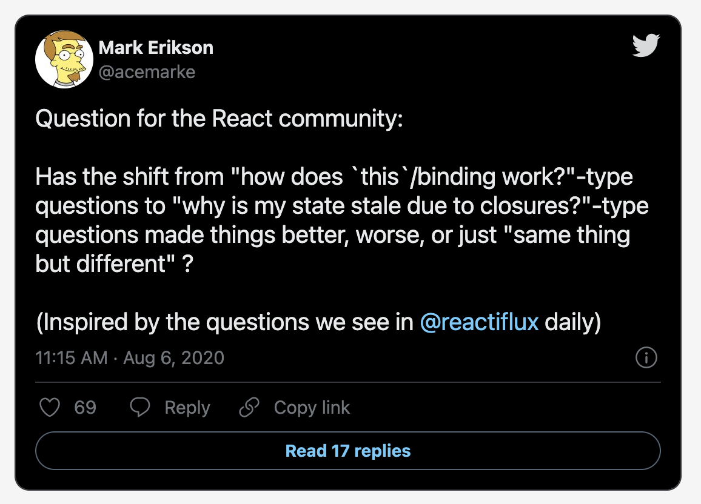

[원문](https://tkdodo.eu/blog/hooks-dependencies-and-stale-closures)

dependency나 hook 같은 단어의 번역은 리액트 공식문서를 기준으로 동일한 단어를 사용했습니다. (dependency는 의존성, hook은 훅, 갈고리 등이 아닌 hook으로)

---

[클로저](<https://ko.wikipedia.org/wiki/%ED%81%B4%EB%A1%9C%EC%A0%80_(%EC%BB%B4%ED%93%A8%ED%84%B0_%ED%94%84%EB%A1%9C%EA%B7%B8%EB%9E%98%EB%B0%8D)>)로 작업하는 것은 꽤 까다로운 일이 될 수 있습니다. 특히 리엑트에서 의존성를 가진 hook을 다룰때 까다로운 일이 될 수 있습니다. (useEffect, useMemo, useCallback을 생각해 보세요.) 많은 버그와 좌절들이 (리액트가 자체적으로 도입한 것이 아님에도) 해당 개념에 밀접하게 연관되어 있습니다. 클로저는 오히려 hook이 의존하는 언어 개념입니다.

저는 Mark Erikson의 이 질문을 좋아합니다.



(트윗 번역: 리액트 커뮤니티에 질문: "this 바인딩이 어떻게 동작합니까" 같은 유형의 질문이 "클로저로 인해 state가 오래된(stale) 이유는 무엇입니까" 같은 유형의 질문으로 바뀐 것은 더 좋은지, 나쁜지 혹은 "동일하지만 다른"가요?)

나는 개인적으로 더 좋아졌다고 생각합니다. 클래스 컴포넌트에서 _this_ 를 사용하는 것은 고통스러운데다 대부분 런타임에서 에러가 나타났습니다. 이에 반해, 오래된 클로저로 인해 생기는 동작들은 좀 더 교묘하고 엣지 케이스에서 발생합니다. 그러나 가장 큰 이점은 이러한 동작들은 [react-hooks/exhaustive-deps](https://reactjs.org/docs/hooks-rules.html#eslint-plugin) eslint 규칙을 이용해 정적으로 분석이 가능하다는 것입니다.

이 포스트에서 저는 오래된 클로저가 무엇인지, 리액트와 hook과 어떤 관련이 있는지, 그리고 왜 lint 규칙이 중요해서 해당 규칙을 _error_ 로 설정해야하는지에 대해 설명하려고 합니다. 이를 위해선 첫번째로 (오래된) 클로저가 무엇인지부터 이해해야 합니다.

# 클로저란 무엇인가

저는 클로저의 개념을 설명하긴 다소 어렵다고 생각합니다. [MDN](https://developer.mozilla.org/ko/docs/Web/JavaScript/Closures)의 설명을 보시죠:

> 클로저는 함수와 함수가 선언된 어휘적 환경(the lexical environment)의 조합이다. 즉, 클로저는 내부 함수에서 외부 함수의 스코프로 접근할 수 있게 한다. 자바스크립트에서 클로저는 함수가 생성될 때마다 함수가 생성되는 시점에 생성된다.

저는 이를 다음과 같이 바꿔서 말하겠습니다: 자바스크립트 함수는 자신의 바깥에 정의된 함수를 "보고", 상호작용 할 수 있습니다. 잘 모르실 수도 있지만 이 개념을 굉장히 자주 쓰실 겁니다. 예를 들어 콜백 함수 내에서 리액트 컴포넌트의 props를 사용하는 경우에,

```js
// a-simple-closure

function Counter({ count }) {
  const logCount = () => {
    // 💡 외부 스코프에서 count에 접근
    console.log("count", count);
  };

  return <button onClick={logCount}>Show me the count</button>;
}
```

_logCount_ 는 _count_ prop 처럼 Counter 컴포넌트에서 정의한 모든 요소에 접근할 수 있습니다. 함수를 부모 함수의 외부로 옮겨봄으로서 클로저에 의존하고 있는지 쉽게 확인할 수 있습니다. 이 함수가 더 이상 작동하지 않는 이유는 더 이상 클로저에 포함되어 있지 않아서 해당 요소에 접근할 수 없기 때문입니다.

```js
// moving-it-up

// ❌ 'count' 가 정의되지 않음. (no-undef)
const logCount = () => {
  console.log("count", count);
};
function Counter({ count }) {
  return <button onClick={logCount}>Show me the count</button>;
}
```

React의 클로저에 대한 좋은 점은 컴포넌트가 새 prop으로 다시 렌더링되면 "그냥 작동"한다는 것입니다. 이 인터렉티브 예제를 보세요.
(역주: 해당 예제는 실제로 동작하는 코드로 이루어져 있으므로 원문 링크를 통해 직접 체험해 보는 것을 추천드립니다.)

```js
function App() {
  const [count, increment] = React.useReducer(prev => prev + 1, 1);

  const logCount = () => {
    log(count);
  };

  return (
    <div>
      <div>count is {count}</div>
      <button onClick={increment}>increment</button>
      <button onClick={logCount}>log</button>
    </div>
  );
}

render(
  <div style={{ color: "black " }}>
    <App />
    <div id="result">log:</div>
  </div>
);

// 인터렉티브 예제에서 로그를 기록하는 방법
function log(value) {
  document.getElementById("result").innerHTML = "log: " + String(value);
}
```

두 버튼을 모두 여러번 클릭할 수 있고 로그 함수가 클로저에 포함된 count를 통해 항상 "최신의" count에 접근할 수 있는 것을 확인 할 수 있습니다. 혹은 그렇게 보입니다.

그런데 왜 그럴까요? 그리고 항상 그럴까요?
